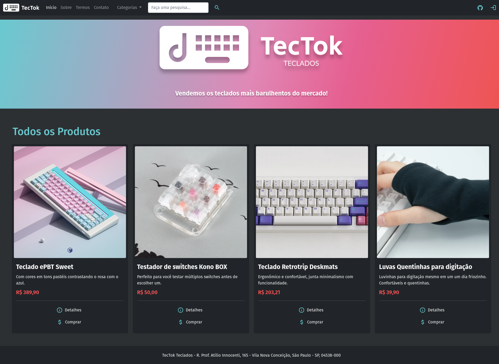
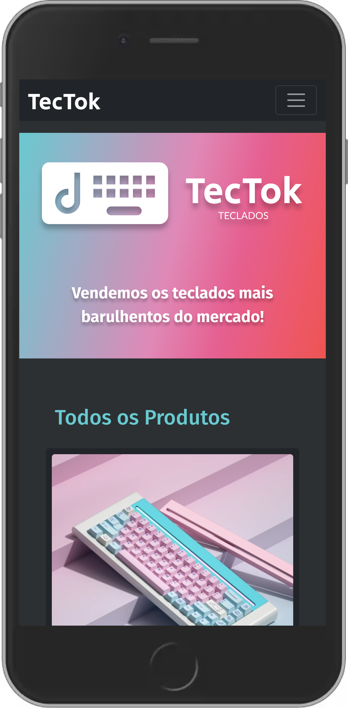

# etec-tectok-teclados
A keyboard online store developed in the PW-II classes at ETEC with PHP and bootstrap

Translations: [:brazil: Português (BR)](README.md)

---

<a href="https://tectok.herokuapp.com" target="_blank" rel="noopener noreferrer">
    
</a>

<p align="center">
    <strong><a href="https://tectok.herokuapp.com" target="_blank" rel="noopener noreferrer">tectok.herokuapp.com</a></strong>
</p>

## Demo

### Desktop



### Mobile



## Running

How to run the project locally.

### Using PHP Development Server

For my personal use, I think that the [`php`](https://www.php.net/downloads.php) CLI is the best way to start a local server.

1. Clone this repository
2. In the repository root directory, run:

```sh
php -S localhost:4002 -t src

# or using composer:
composer start
```

> You can chose any other port

3. Go to `http://localhost:4002`
